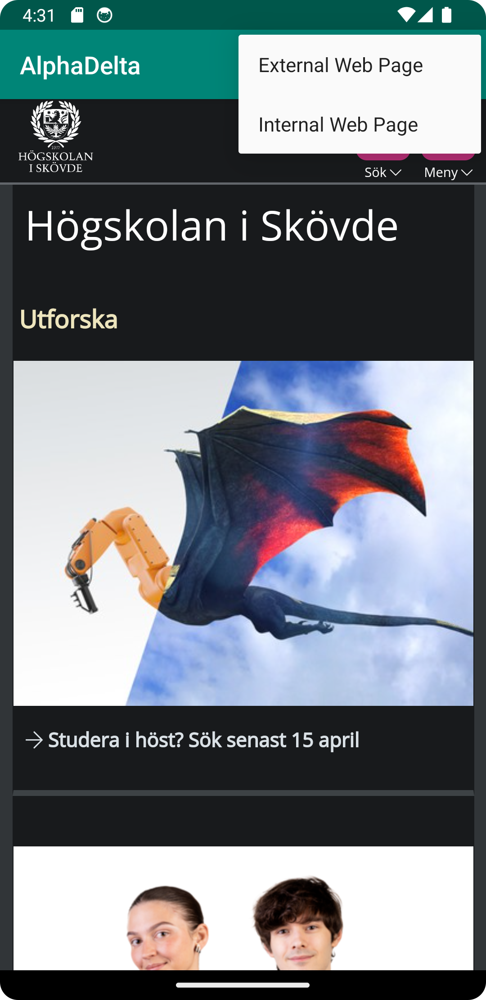
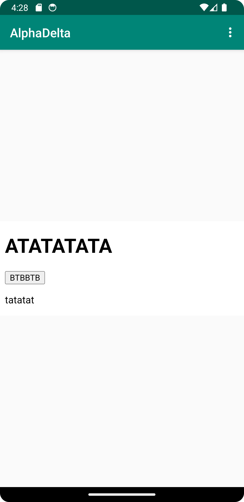

# Rapport

**Skriv din rapport här!**

_Du kan ta bort all text som finns sedan tidigare_.

## Följande grundsyn gäller dugga-svar:

Write a short report where you explain the things that you have done. Include one (1) screenshot showing your internal web page and one (1) screenshot showing your external web page. Hint: This is a function built into the android virtual device. Make sure you include all other parts that are required in the report as described in the assignment requirements.

- Renaming the Application
```
<resources>
    <string name="app_name">AlphaDelta</string> 
    ...
</resources>
```
- Enabling Internet Access. Internet access was enabled by modifying the AndroidManifest.xml file.
```
<uses-permission android:name="android.permission.INTERNET" />
```
- Creating a WebView Element. The existing TextView element in the activity_main.xml layout file was replaced with a WebView element. This change allows the application to display web pages directly in the app interface.
- Instantiating the WebView. A private member variable named myWebView of type WebView was created. This variable was instantiated in the onCreate() method of the application’s main activity using the findViewById()
```
myWebView = findViewById(R.id.my_webview);
```
- Managing Web Content
To display web pages, two methods were implemented:
```
showExternalWebPage() //: Loads an external URL.
showInternalWebPage() //: Loads a local HTML page from the Android assets folder.
```

Bilder läggs i samma mapp som markdown-filen.




Läs gärna:

- Boulos, M.N.K., Warren, J., Gong, J. & Yue, P. (2010) Web GIS in practice VIII: HTML5 and the canvas element for interactive online mapping. International journal of health geographics 9, 14. Shin, Y. &
- Wunsche, B.C. (2013) A smartphone-based golf simulation exercise game for supporting arthritis patients. 2013 28th International Conference of Image and Vision Computing New Zealand (IVCNZ), IEEE, pp. 459–464.
- Wohlin, C., Runeson, P., Höst, M., Ohlsson, M.C., Regnell, B., Wesslén, A. (2012) Experimentation in Software Engineering, Berlin, Heidelberg: Springer Berlin Heidelberg.
